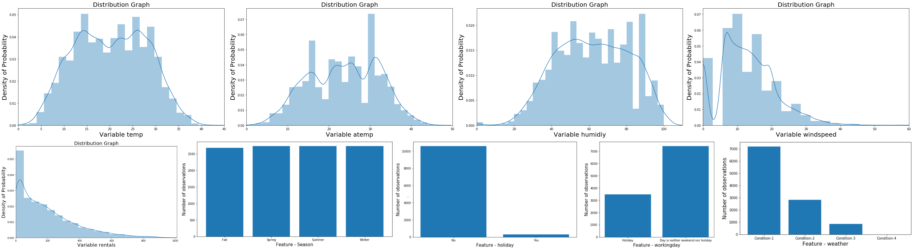

# Bike_Rental_Prediction

Demand Forecasting: Public Bike Rental Predictive Modeling.

Demand forecasts are essential for any business to manage its different business
activities but at the same time are difficult to do with utmost accuracy using traditional
techniques. Big Data is part of any business acumen in today’s world and the world needs
to embrace it and make maximum use of it to increase productivity, economic benefits, etc.
Huge volumes of data are generated, and many data analyst and scientists are working on
historical data to derive meaningful insights and provide better data-driven decisions. In
order to do so state of the art machine learning and artificial intelligence is used and
perfected to outsmart the competitors. The aim of the project is to use the state-of-the-art
machine learning techniques and improve their implementation to get the most accurate
predictive models for our data and forecast better demand with least errors. The project
aims to showcase better demand forecasting in an emerging bike sharing and Public
Vehicle Rental Space. A number of forecasting models like Linear Regression, Clustering,
Random Forest, Artificial Neural Nets are built, experimentally investigated, and their
practicality discussed. The results will be used to investigate consumer behavior on demand
forecasting and the overall impact on the business as a whole.

#

# Exploratory Data Analysis

# Data Attributes Distribution Graphs

# Predictive Model Line Graphs

